% 搜索结果聚类
% 肖文斌
% 12/13/2016

# 简介

## 现状及问题

- 搜索引擎返回排序后的网页片段列表
- 用户从返回的大量结果中查找自己真正关心的内容
- 用户花费时间完成内容检索的后续工作

## 解决方案

- 搜索引擎精度提高，排名算法更加智能
- 在有限的搜索引擎精度下，组织内容使其更加容易被用户浏览
- 大概思路，将搜索引擎返回的文档聚类后呈现给用户

## 限制条件之一

- 相关性

	聚类方法产生的结果必须能够将同用户查询相关的文档和不相关的文档分在不同的类别中

- 易于浏览

	产生的聚类必须是更容易被用户浏览的，可以让用户快速的判断某个类别是否是自己感兴趣的，为此每个类别必须具有简介明了的描述

- 重叠性

	不同聚类之间是相互重叠的，这是基于这样一个事实，一个文档往往会涉及到多个话题

## 限制条件之二

- 小量数据鲁棒性

	搜索引擎返回的结果只是对网页简单的介绍片段，如果在聚类时请求下载原网页数据，会带来极大的网络请求延时，是不可被用户接受的，因此聚类方法只能根据这些片段进行聚类分析，同时要保证聚类的质量

- 增量算法

	搜索引擎不可能一次返回所有查询结果，需要发起多次请求，为了节省时间，请求查询结果跟进行聚类是并行的，因此要求聚类算法是增量的

# 后缀树聚类 - STC

## 参考文献

主要参考了 Web Document Clustering: A Feasibility Demonstration <http://homes.cs.washington.edu/~etzioni/papers/sigir98.pdf>

## 什么是Trie树？

由单词组bear, bell, bid, bull, buy, sell, stock, stop构造的Trie树

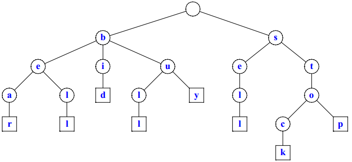

## 什么是后缀树 - 构造

单词banana的后缀树，将banana的所有后缀（banana, anana, nana, ana, na, a）插入到Trie树

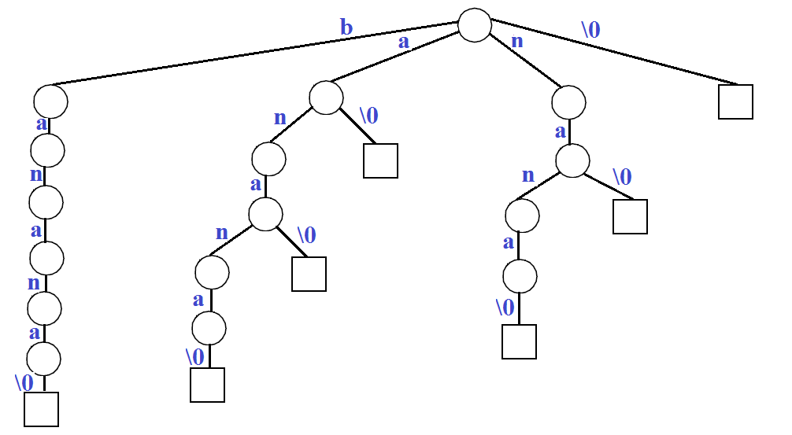

## 什么是后缀树 - 压缩

将上面的Trie树中只有一个子节点的内部节点合并到父节点中，就得到了一颗后缀树，也即后缀树是压缩后的Trie树

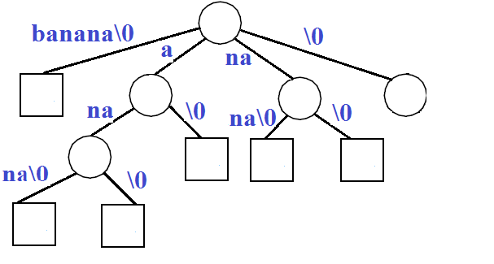

## Online后缀树构造方法

关于后缀的构造详见 Ukkonen's algorithm <https://www.cs.helsinki.fi/u/ukkonen/SuffixT1withFigs.pdf>

## 用于聚类的后缀树

不同于常规后缀树以字符作为基本单位，用于文档聚类的后缀树以单词作为基本单位

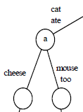

## 后缀树聚类的优势

- 增量的，可以跟查询请求同步进行
- 线性的，跟文档数量呈线性关系

# STC的实现

## 步骤

- 文档清理
- 生成基类
- 合并基类

## 文档清理

- 所谓文档，即搜索结果返回的网页片段
- 清理工作主要有，将单词转换为原型（比如复数转为单数），去除标点符号以及无效token
- 最终将文档转换为tokens

## 生成基类 - 步骤

- 基类可以看成是对文档的初步聚类，之后还要进一步对基类进行聚类
- 基类聚类的本质可以看成是构建一个词汇短语到文档集合的索引表
- 基类聚类的过程就是构造后缀树的过程

## 生成基类 - 构造后缀树

假设现在有三个文档，其内容分别为cat ate cheese, mouse ate cheese too, cat ate mouse too，基于这三个文档构造的后缀树如下

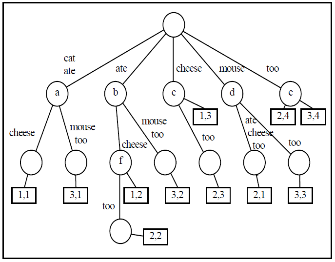

树的内部节点都对应有词汇短语，叶节点记录了文档id以及在后缀id，可以看出每棵子树都表示共享根节点短语的文档集合，也即基类

## 生成基类 - 图表展示

基类的生成实质可以看成是短语到包含短语的文档集合的索引表，只不过在这里构造索引表时用到了线性增量的后缀树算法

<table>
<tr><td><strong>节点</strong></td><td><strong>短语</strong></td><td><strong>文档集合</strong></td></tr>
<tr><td>a</td><td>cat ate</td><td>1,3</td></tr>
<tr><td>b</td><td>ate</td><td>1,2,3</td></tr>
<tr><td>c</td><td>cheese</td><td>1,2</td></tr>
<tr><td>d</td><td>mouse</td><td>2,3</td></tr>
<tr><td>e</td><td>too</td><td>2,3</td></tr>
<tr><td>f</td><td>ate cheese</td><td>1,2</td></tr>
</table>

## 生成基类 - 打分

- 为了便于后续对聚类进行排序，需要对基类进行打分
- 打分公式如下：

	Score(BaseCluster)=len(BaseCluster)*len(Phrases)

## 合并基类

- 利用图论知识来合并基类
- 合并操作基于文档集之间相似度的度量

## 合并基类 - 相似性度量

- 相似度度量公式十分直观，见下面的韦恩图

	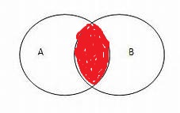

- 每个基类本质上是以文档id为内容的集合，度量集合相似性采用如下公式：

		if len(A & B) / len(A) > threshold and len(A & B) / len(B):
			# 相似的
		else:
			# 不相似的

## 合并基类 - 合并

- 构造图，将各个文档集当做节点，将文档集相似性作为节点间是否存在边的度量
- 图的连通子图对应合并后的聚类

	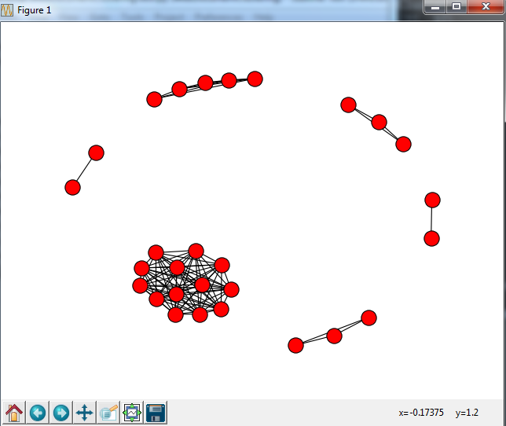

## 合并基类 - 小结

从实验生成的连通子图可以发现两个特点：

- 大多数文档集中在一个类别中，这是由于搜索引擎返回结果必然是跟用户查询相关的，因此大部分文档都在谈论同一话题

- 基于连通子图来构造聚类隐含了一个假设，集合之间相似性具有传递性

- 我的主要工作围绕数据的这两个特点展开

# 相似性改进

## 相似性传递 - 合理性判断

当A文档跟B文档相似，且B文档跟C文档相似时，我们能否判断A文档跟C文档也相似

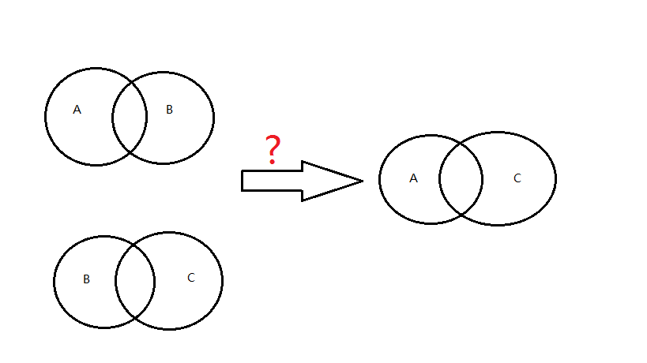

## 相似性传递 - 有效

显然在下图中当相似性构成一个回路时，相似性传递必然是有效的

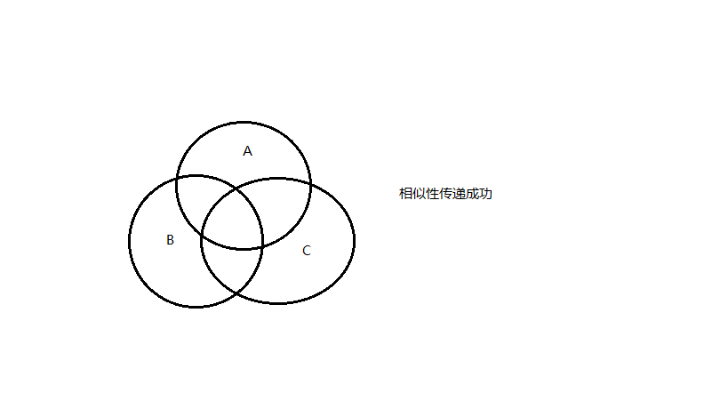

## 相似性传递 - 无效

举个例子，python这个单词既可以指一门语言，又可以指动物蟒蛇。当搜索结果中包含的文档既有讲python语言的，也有讲蟒蛇的，同时又有讲python语言命名的历史渊源。显然介绍python语言命名历史渊源的文档将会为python语言和蟒蛇搭建相似性桥梁，这必然是错误的

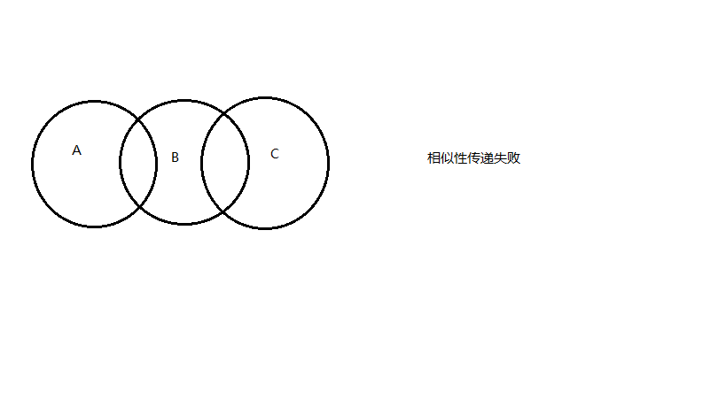

## 相似性传递 - 改进

将图中关节点的边去掉后，再求连通子图

# 新的合并基类算法

## 搜索结果数据分布 - 单集中趋势

从直观上来看，搜索结果必然是跟用户检索相关的，也即大部分返回内容是用户关心的，此外不排除搜索引擎返回其他弱相关或者无关内容。也即大部分结果最终应该被划分到同一个分类下面

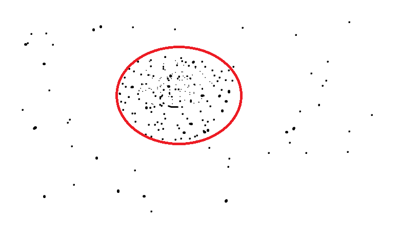

**注：**以上只是个人直观猜想，还需要检索大量文档来验证这个猜想

## 搜索结果数据分布 - 多集中趋势

从直观上来看，还有一种典型的情况，当用户本身输入的查询就具有歧义时，显然搜索引擎返回的结果显然会呈现出多集中趋势

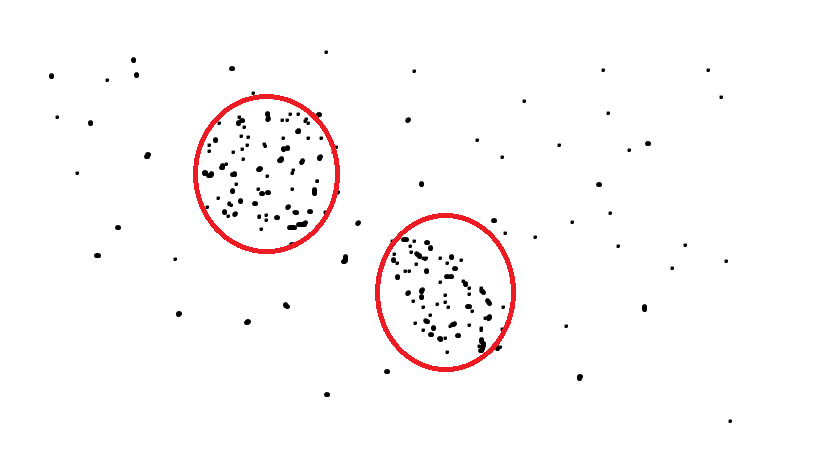

**注：**以上只是个人直观猜想，还需要检索大量文档来验证这个猜想

## 搜索结果数据分布 - 混合集中趋势

一个文档往往会涉及到多个话题，因为同一份文档常常可以同时属于不同的类别

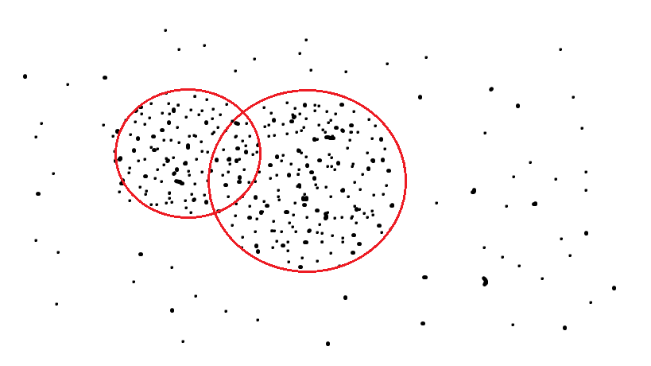

## K-Base合并基类

参考文献采用的思路是将类似的文档集进行归类，如果反过来理解就是，每个文档集必定有一个文档集的基，见下例子：

	# 三个文档集
	(1, 1, 0, 1, 0, 1, 0)
	(0, 1, 0, 1, 1, 1, 0)
	(0, 0, 1, 1, 0, 1, 0)
	# 对应的文档基
	(0, 0, 0, 1, 0, 1, 0)

## 实现K-Base算法 - 伪代码

	从doc_set_list中找出汉明距离最近的两个文档集doc_set1, doc_set2
		doc_base = doc_set1 & doc_set2
		将doc_set1和doc_set2从doc_set_list中移除
		将doc_base加入到doc_set_list中
		更新文档集跟文档基的对应关系

		如果doc_set_list中所有文档集含有1的个数小于等于K，则break
		否则，继续处理

# Thank You!